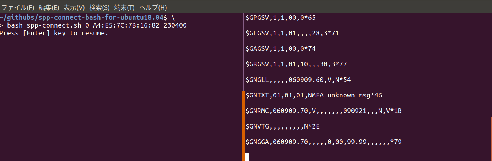

# spp-connect-bash-for-ubuntu18.04

Ubuntu18.04の環境にて、\
GPSモジュール<sup>[1](#note1)</sup>Bluetooth SPP接続を行うためのScript  

容易に接続するためのBash Scriptを書いた.

## 使い方

接続するための仮想ポートを用意する．  
- ${ID} : 仮想ポートのID、基本的には0でよい  
- ${ADDRESS} : 接続するデバイスアドレス
- ${BAUDRATE} : ボーレート

```
bash spp-connect.sh ${ID} ${ADDRESS} ${BAUDRATE}
```

一度通信行えば.spp-connect-configにその情報が保存されるため、  
次回からは、そのまま行えば良い

```
bash spp-connect.sh
```



***

<div id="note1">1 : https://www.bizstation.jp/ja/drogger/dg-pro1rws_index.html</div>
